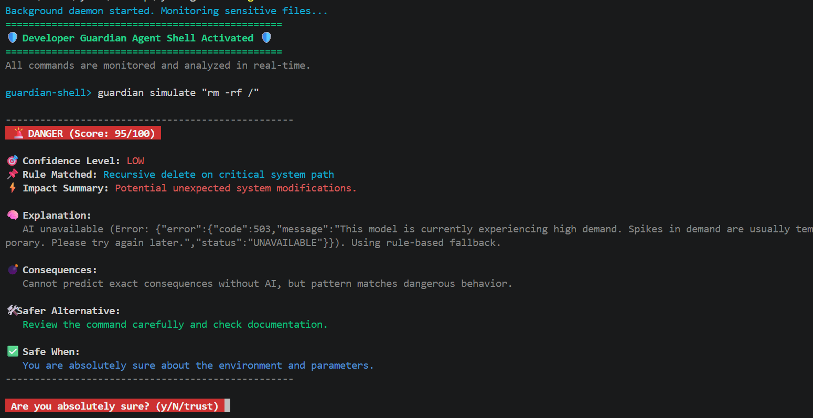

# 🛡️ SystemGuardian

> AI-powered CLI that intercepts dangerous terminal commands in real-time — with risk scoring, Gemini AI explanations, and safe mode blocking.

[](https://www.npmjs.com/package/systemguardian)
[](https://www.npmjs.com/package/systemguardian)
[](https://opensource.org/licenses/MIT)
[](https://nodejs.org)
[]()

---

## ⚡ Quick Start

```bash
npm install -g systemguardian
guardian config --key YOUR_GEMINI_API_KEY
guardian on
```

No `.env` file. No manual config. Works globally on any project, any language.

---

## 🎬 Demo



---

## 🧠 How It Works

```
Your Command
     ↓
Guardian Shell — intercepts every command
     ↓
Rule-based Analyzer — risk score 0 to 100
     ↓
Gemini AI — explains consequences + safer alternative
     ↓
Safe ✅  /  Warning ⚠️  /  Blocked 🚨
```

---

## 🔑 API Key Setup — One Time Only

```bash
guardian config --key YOUR_GEMINI_API_KEY
```

Key is stored at `~/.guardian/config.json` with `600` permissions — owner only, never exposed.

```bash
guardian config --show      # view saved key (masked)
guardian config --remove    # remove saved key
```

> **No API key?** Tool still works — rule-based detection runs as fallback. AI explanations disabled.

Get free key → [Google AI Studio](https://aistudio.google.com/app/apikey)

---

## 🔍 Real Example

```bash
guardian simulate "rm -rf /"
```

```
🚨 DANGER (Score: 95/100)

🎯 Confidence     : HIGH
📌 Rule Matched   : Recursive delete on critical system path
⚡ Impact Summary : Catastrophic system failure and irreversible data loss

🧠 Explanation:
   Attempts to recursively delete every file starting from root.
   On Linux/macOS this destroys the OS. On Windows via Git Bash
   this targets the root of the current drive.

💣 Consequences:
   Complete data loss. System becomes unbootable. No recovery
   without a full backup.

🛠️ Safer Alternative:
   Use specific path: rm -rf ./tmp
   On Windows: Remove-Item -Path 'C:\Users\you\folder' -Recurse -Force

✅ Safe When:
   Almost never. Only in throwaway Docker containers or
   isolated VMs meant to be destroyed.
```

---

## ▶️ All Commands

### Outside Guardian Shell

| Command | Description |
|---|---|
| `guardian on` | Start the protected shell |
| `guardian simulate "cmd"` | Dry-run any command safely |
| `guardian safe-mode on\|off` | Toggle strict blocking mode |
| `guardian status` | Show config and API key status |
| `guardian config --key KEY` | Save Gemini API key (one time) |
| `guardian config --show` | View saved key (masked) |
| `guardian config --remove` | Remove saved API key |
| `guardian install-shell` | Auto-start guardian on terminal open |

### Inside Guardian Shell

| Command | Description |
|---|---|
| `history` | All commands run this session |
| `last` | Last command you ran |
| `status` | Config + API key status |
| `info <cmd>` | Explain risk of any command |
| `ls` / `ls -la` | List files in current directory |
| `pwd` | Print current directory |
| `whoami` | Show current user |
| `clear` | Clear terminal screen |
| `help` | Show all available commands |
| `exit` / `quit` | Exit guardian shell |

---

## 📖 Info Command — Built-in Knowledge Base

```bash
# inside guardian shell:
info rm -rf
info chmod 777
info sudo
info dd
info curl
info wget
info git push --force
info docker system prune
info mkfs
```

Each entry shows: what it does, risk level, safe conditions, and safer alternative.

---

## 🛡️ Risk Levels

| Score | Level | Action |
|---|---|---|
| 0 – 29 | ✅ Safe | Executes directly |
| 30 – 69 | ⚠️ Warning | Shows AI analysis, then executes |
| 70 – 100 | 🚨 Danger | Blocks — asks confirmation |

**Safe Mode** (`guardian safe-mode on`) — score ≥ 70 is hard blocked. No bypass possible.

---

## 🔐 Security Features

| Feature | Detail |
|---|---|
| Shell injection blocked | Metacharacters, backticks, eval, reverse shells |
| Path traversal blocked | `../../..` patterns rejected |
| Rate limiting | Max 30 commands per minute |
| Command length limit | Max 2048 characters |
| Secret redaction | API keys, tokens, passwords never stored plain |
| Config permissions | `~/.guardian/config.json` is `600` — owner only |
| No kernel access | Fully user-space, no root required |
| No telemetry | Nothing sent anywhere except your own Gemini API |

---

## 📁 Project Structure

```
src/
  cli/
    index.js       → CLI entry + all guardian commands
    shell.js       → Guardian shell + built-in commands
    installer.js   → Shell auto-start integration
    formatter.js   → Terminal output formatting
  core/
    analyzer.js    → Risk scoring engine
    llm.js         → Gemini AI integration
    config.js      → Global config (~/.guardian/config.json)
    logger.js      → Secure action logging with secret redaction
    rules.json     → Dangerous command patterns reference
  daemon/
    index.js       → Background stub (reserved)
```

---

## 📦 Local Development

```bash
git clone https://github.com/ayushsingh2005-coder/developer-guardian-agent
cd developer-guardian-agent
npm install
npm link
guardian config --key YOUR_KEY
guardian on
```

---

## ⚙️ Requirements

- Node.js >= 16
- Works on Linux, macOS, Windows (PowerShell + Git Bash)
- Gemini API key — free, optional

---

## 📜 License

MIT © [Ayush Singh](https://github.com/ayushsingh2005-coder)