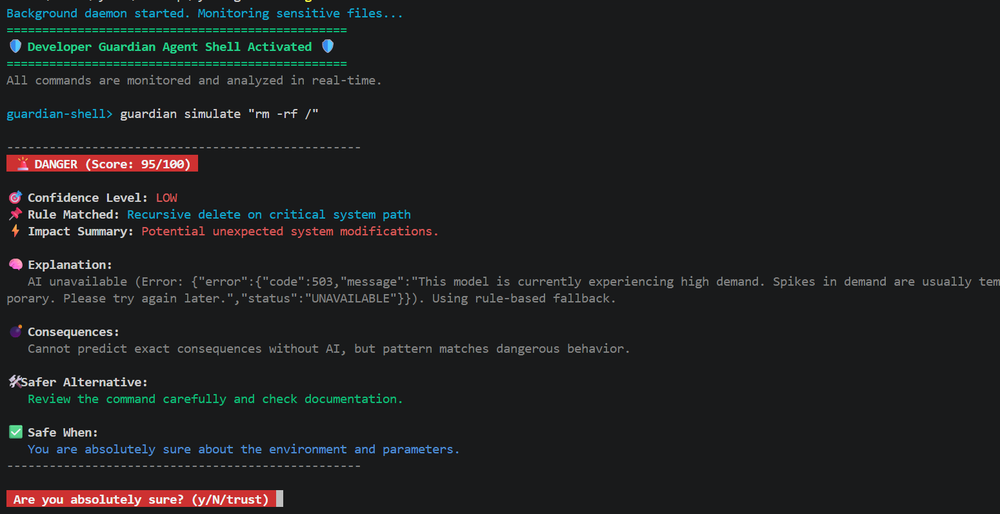

# 🛡️ SystemGuardian

> Policy-driven terminal safety layer for developers and teams.
> SystemGuardian intercepts dangerous terminal commands before execution using repository policies, context-aware analysis, deterministic rules, and AI-powered explanations.

[](https://www.npmjs.com/package/systemguardian)
[](https://www.npmjs.com/package/systemguardian)
[](https://opensource.org/licenses/MIT)
[](https://nodejs.org)
[]()

---

# ⚡ Quick Start

```bash
npm install -g systemguardian
guardian config --key YOUR_GEMINI_API_KEY
guardian on
```

No `.env` file. No manual setup. Works globally across projects and languages.

---

# ✨ New in v1.2.0

## ✅ Repository-Level Policies

Define repository-specific terminal safety rules using:

```json
.guardianrc
```

---

## ✅ Protected Branch Enforcement

Automatically blocks dangerous git operations on protected branches like:

* `main`
* `master`
* `release/*`

---

## ✅ Context-Aware Command Analysis

Guardian understands:

* current repository
* current git branch
* project policy
* command intent

---

## ✅ Safer Alternatives

Example:

```bash
git push --force
```

Guardian suggests:

```bash
git push --force-with-lease
```

---

SystemGuardian is evolving from an AI-powered command analyzer into a configurable terminal safety infrastructure layer.

---

# 🎬 Demo



---

# 🧠 How It Works

```text
Your Command
     ↓
Guardian Shell — intercepts command
     ↓
Repository Policy Engine (.guardianrc)
     ↓
Rule Engine + Git Context Detection
     ↓
Gemini AI — explanation + safer alternative
     ↓
Allow ✅ / Warn ⚠️ / Block 🚨
```

---

# 🏢 Repository Policies (`.guardianrc`)

SystemGuardian supports repository-level safety policies.

Each project can define its own rules using:

```json
.guardianrc
```

Example:

```json
{
  "safeMode": true,

  "protectedBranches": [
    "main",
    "master",
    "release/*"
  ],

  "productionKeywords": [
    "prod",
    "production",
    "staging"
  ],

  "blocked": [
    "terraform destroy",
    "kubectl delete namespace",
    "aws s3 rm --recursive"
  ],

  "warn": [
    "git push --force",
    "docker compose down -v",
    "npm publish"
  ]
}
```

---

## What This Enables

* Prevent force-pushes to protected branches
* Block destructive infrastructure commands
* Define team-specific terminal policies
* Share safety rules across repositories
* Context-aware command enforcement

---

## Example

On protected branch:

```bash
git push --force
```

Guardian automatically blocks execution:

```text
❌ BLOCKED by project policy

Protected branch detected: main

Safer alternative:
git push --force-with-lease
```

If no `.guardianrc` exists, Guardian falls back to built-in safety rules automatically.

---

# 🔑 API Key Setup — One Time Only

```bash
guardian config --key YOUR_GEMINI_API_KEY
```

Key is stored at:

```text
~/.guardian/config.json
```

with secure owner-only permissions.

Useful commands:

```bash
guardian config --show
guardian config --remove
```

---

## No API Key?

SystemGuardian still works.

Built-in deterministic rules continue protecting commands even without AI enabled.

Get free Gemini API key:
https://aistudio.google.com/app/apikey

---

# 🔍 Real Example

```bash
guardian simulate "rm -rf /"
```

```text
🚨 DANGER (Score: 100/100)

📌 Rule Matched:
Recursive delete on root filesystem

⚡ Impact:
Catastrophic system destruction and irreversible data loss

🧠 Explanation:
Attempts to recursively delete every file starting from root.

🛠️ Safer Alternative:
Use specific path:
rm -rf ./tmp
```

---

# ▶️ Commands

## Outside Guardian Shell

| Command                      | Description                |
| ---------------------------- | -------------------------- |
| `guardian on`                | Start protected shell      |
| `guardian simulate "cmd"`    | Dry-run command safely     |
| `guardian safe-mode on\|off` | Toggle strict blocking     |
| `guardian status`            | Show config and API status |
| `guardian config --key KEY`  | Save Gemini API key        |
| `guardian config --show`     | Show saved key (masked)    |
| `guardian config --remove`   | Remove saved API key       |
| `guardian install-shell`     | Auto-start guardian shell  |

---

## Inside Guardian Shell

| Command         | Description             |
| --------------- | ----------------------- |
| `history`       | Show session history    |
| `last`          | Show last command       |
| `status`        | Show current status     |
| `info <cmd>`    | Explain risk of command |
| `ls` / `ls -la` | List directory contents |
| `pwd`           | Print current directory |
| `whoami`        | Show current user       |
| `clear`         | Clear screen            |
| `help`          | Show help               |
| `exit` / `quit` | Exit shell              |

---

# 📖 Built-in Knowledge Base

Inside Guardian shell:

```bash
info rm -rf
info chmod 777
info git push --force
info terraform destroy
info docker system prune
```

Guardian explains:

* what command does
* why it is dangerous
* when it is safe
* safer alternatives

---

# 🛡️ Risk Levels

| Score    | Level      | Action                          |
| -------- | ---------- | ------------------------------- |
| 0 – 29   | ✅ Safe     | Executes directly               |
| 30 – 69  | ⚠️ Warning | Warns before execution          |
| 70 – 100 | 🚨 Danger  | Blocks or requires confirmation |

---

# 🔐 Security Features

| Feature                      | Detail                                                |
| ---------------------------- | ----------------------------------------------------- |
| Protected branch enforcement | Blocks dangerous git operations on protected branches |
| Shell injection blocking     | Prevents metacharacter abuse and reverse shells       |
| Path traversal protection    | Rejects malicious filesystem traversal                |
| Rate limiting                | Max 30 commands/minute                                |
| Secret redaction             | API keys and tokens never logged                      |
| Repository policy engine     | Project-level configurable rules                      |
| Safe config permissions      | `~/.guardian/config.json` secured                     |
| No telemetry                 | No hidden data collection                             |
| User-space only              | No root/kernel access required                        |

---

# 📄 Example Policy File

Copy the example policy:

```bash
cp .guardianrc.example .guardianrc
```

Customize rules for your own projects or team workflows.

---

# 📁 Project Structure

```text
src/
  cli/
    index.js       → CLI entry and commands
    shell.js       → Guardian shell runtime
    installer.js   → Shell auto-start integration
    formatter.js   → Terminal formatting utilities

  core/
    analyzer.js    → AI + risk analysis engine
    ruleEngine.js  → Deterministic command rules
    policy.js      → .guardianrc loading and validation
    gitContext.js  → Current branch/context detection
    llm.js         → Gemini AI integration
    config.js      → Global config management
    logger.js      → Secure logging
    rules.json     → Dangerous command patterns

  daemon/
    index.js       → Reserved background daemon
```

---

# 📦 Local Development

```bash
git clone https://github.com/ayushsingh2005-coder/developer-guardian-agent

cd developer-guardian-agent

npm install
npm link

guardian config --key YOUR_KEY
guardian on
```

---

# ⚙️ Requirements

* Node.js >= 16
* Windows / Linux / macOS
* Optional Gemini API key

---

# 🚀 Vision

SystemGuardian is evolving into:

> A configurable terminal firewall for developers.

The goal is simple:

Dangerous commands should be understood before they execute — not after damage is done.

---

# 📜 License

MIT © Ayush Singh
